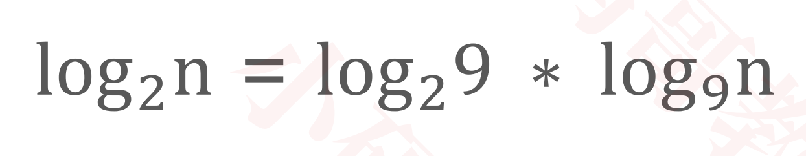
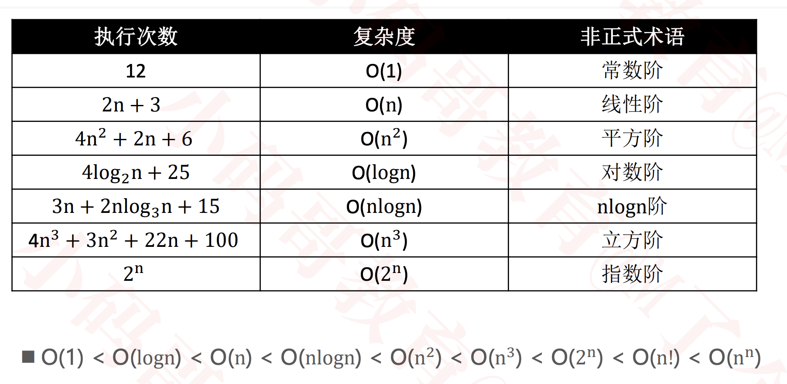
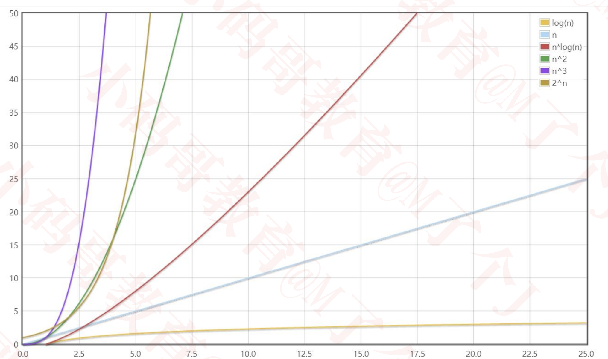
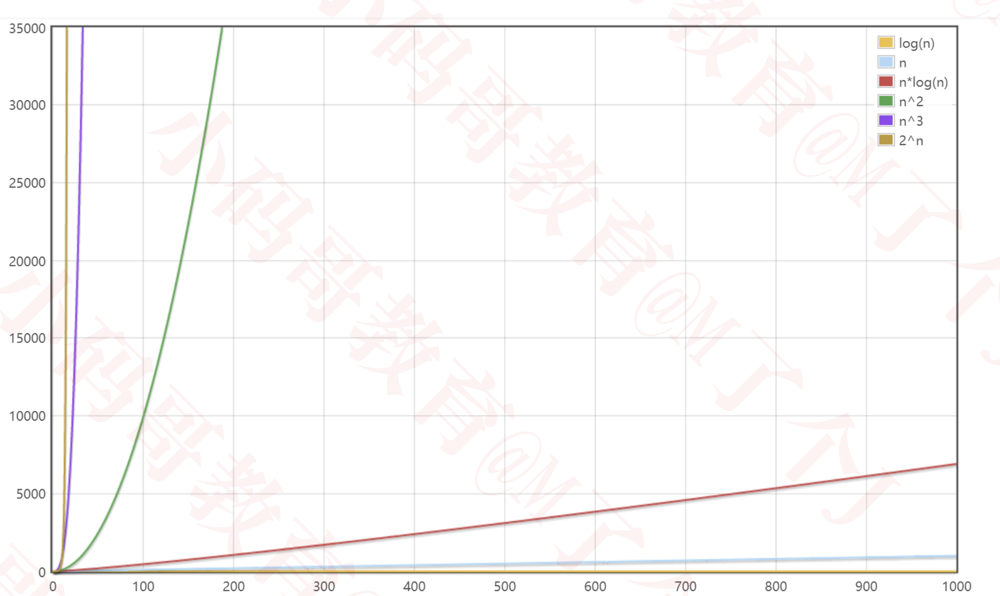
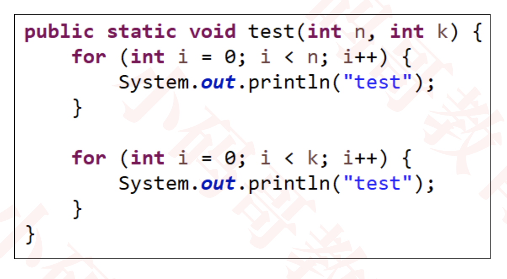

# 一般从以下维度来评估算法的优劣
  * 正确性、可读性、健壮性（对不合理输入的反应能力和处理能力）
  * 时间复杂度(time complexity):估算程序指令的执行次数（执行时间）
  * 空间复杂度(space complexity):估算所需占用的存储空间

# 大O表示法（Big O）
  * 一般用大O表示法来描述复杂度，它表示的是数据规模 n 对应的复杂度

  * 忽略常数、系数、低阶
    + 9 >> O(1)
    + 2n + 3 >> O(n)
    + n^2 + 2n + 6 >> O(n^2)
    + 4n^3 + 3n^2 + 22n + 100 >> O(n^3)

  * 注意：大O表示法仅仅是一种粗略的分析模型，是一种估算，能帮助我们短时间内了解一个算法的执行效率
    
  * 对数阶的细节
    对数阶一般省略底数
      
    所以log2(n) log9(n) 统称为log(n)
  
  * 常见的复杂度
      
  
  * 可以借助函数生成工具对比复杂度的大小
      https://zh.numberempire.com/graphingcalculator.php
  
      数据规模较小时
        
      
      数据规模较大时
        
  
# 算法的优化方向
  * 用尽量少的存储空间
  * 用尽量少的执行步骤（执行时间）
  * 根据情况，可以
    * 空间换时间
    * 时间换空间

# 多个数据规模的情况
  
  复杂度为O(n + k)