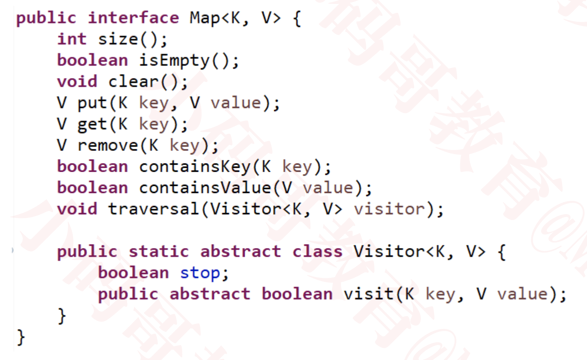

# 映射（Map）
Map 在有些编程语言中也叫做字典（dictionary，比如 Python、Objective-C、Swift 等）

Map 的每一个 key 是唯一的

# Map的接口设计
类似 Set，Map 可以直接利用链表、二叉搜索树（AVL树、红黑树）等数据结构来实现

# Map 与 Set
Map 的所有 key 组合在一起，其实就是一个 Set

因此，Set 可以间接利用 Map 来作内部实现