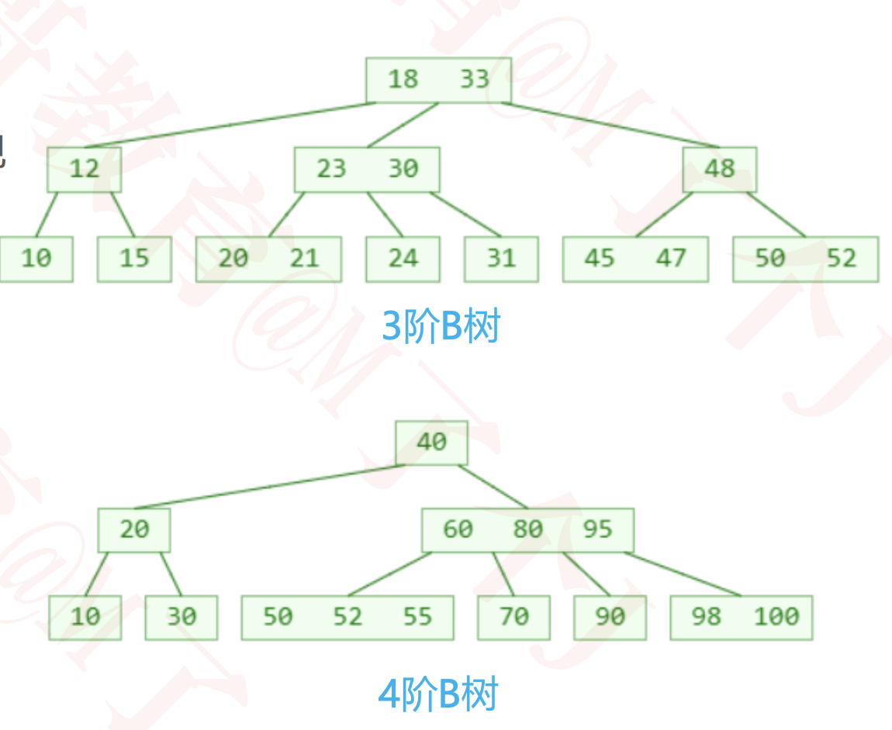
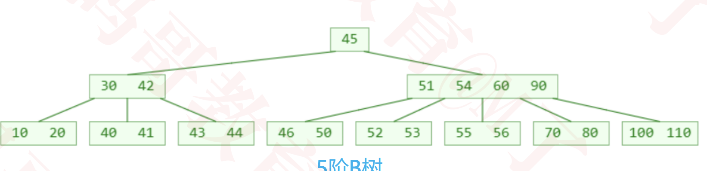
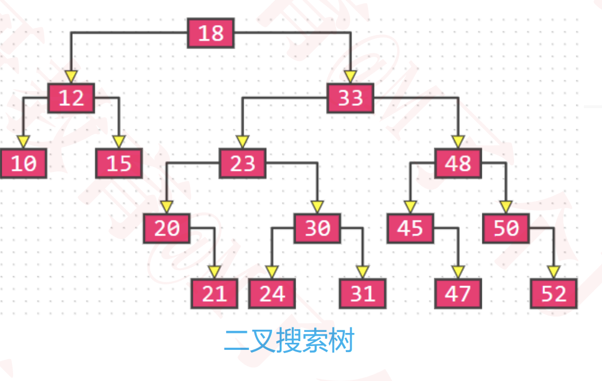
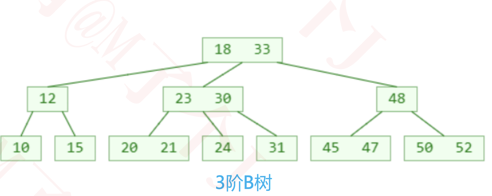
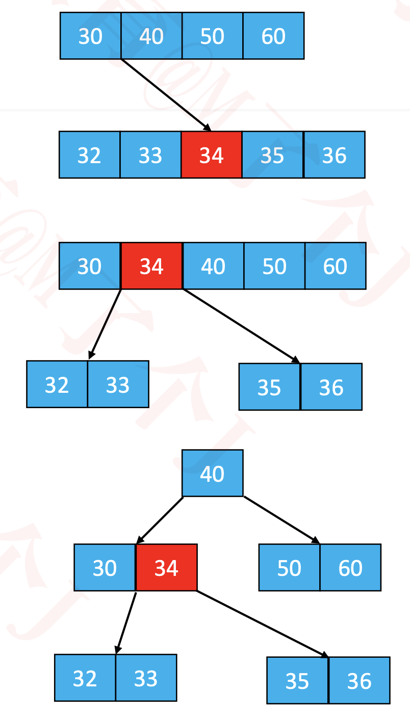
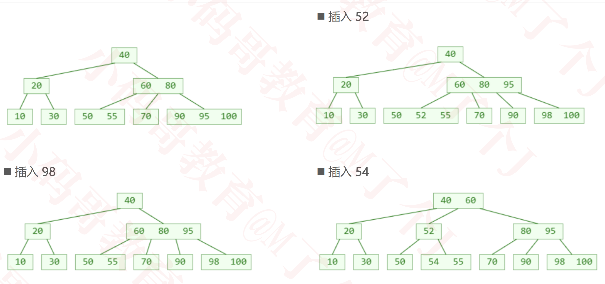
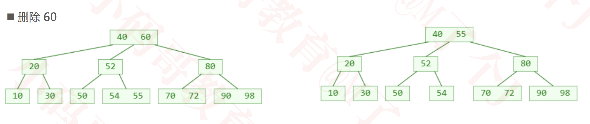
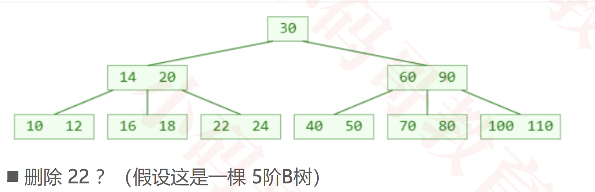
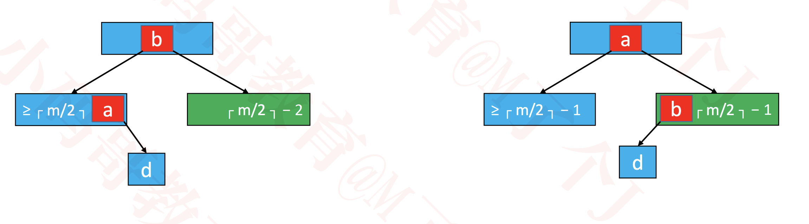
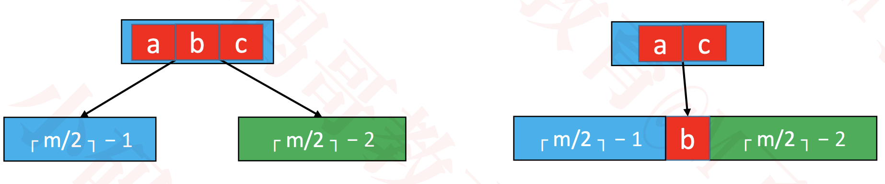

# B树（B-tree、B-树）
  B树是一种平衡的多路搜索树，多用于文件系统、数据库的实现

  1 个节点可以存储超过 2 个元素、可以拥有超过 2 个子节点

  拥有二叉搜索树的一些性质

  平衡，每个节点的所有子树高度一致

  比较矮

  
   

## m阶B树的性质（m≥2）
  假设一个节点存储的元素个数为 x

  根节点：1 ≤ x ≤ m − 1

  非根节点：┌ m/2 ┐ − 1 ≤ x ≤ m − 1

  如果有子节点，子节点个数 y = x + 1

  * 根节点：2 ≤ y ≤ m
  * 非根节点：celling(m/2) ≤ y ≤ m

  * 比如 m = 3，2 ≤ y ≤ 3，因此可以称为（2, 3）树、2-3树
  * 比如 m = 4，2 ≤ y ≤ 4，因此可以称为（2, 4）树、2-3-4树
  * 比如 m = 5，3 ≤ y ≤ 5，因此可以称为（3, 5）树

# B树 VS 二叉搜索树
  B树 和 二叉搜索树，在逻辑上是等价的

  多代节点合并，可以获得一个超级节点
  * 2代合并的超级节点，最多拥有 4 个子节点（至少是 4阶B树）
  * 3代合并的超级节点，最多拥有 8 个子节点（至少是 8阶B树）
  * n代合并的超级节点，最多拥有 2^n 个子节点（ 至少是 2^n阶B树）

  m阶B树，最多需要 log2m 代合并

  
  

# 搜索
  跟二叉搜索树的搜索类似
  
  * 先在节点内部从小到大开始搜索元素
  * 如果命中，搜索结束
  * 如果未命中，再去对应的子节点中搜索元素，重复步骤 1

# 添加
  新添加的元素必定是添加到叶子节点

  如果最右下角的叶子节点的元素个数将超过限制

  这种现象可以称之为：上溢（overflow）

## 上溢的解决(假设5阶)
  上溢节点的元素个数必然等于 m

  假设上溢节点最中间元素的位置为 k
  * 将 k 位置的元素向上与父节点合并
  * 将 [0, k-1] 和 [k + 1, m - 1] 位置的元素分裂成 2 个子节点
    * 这 2 个子节点的元素个数，必然都不会低于最低限制（┌ m/2 ┐ − 1）
  
  一次分裂完毕后，有可能导致父节点上溢，依然按照上述方法解决
  * 最极端的情况，有可能一直分裂到根节点

  

## 添加示例

# 删除 

## 叶子节点
  假如需要删除的元素在叶子节点中，那么直接删除即可

## 非叶子节点
  * 先找到前驱或后继元素，覆盖所需删除元素的值
  * 再把前驱或后继元素删除

  非叶子节点的前驱或后继元素，必定在叶子节点中
    * 所以这里的删除前驱或后继元素 ，就是最开始提到的情况：删除的元素在叶子节点中
    * 真正的删除元素都是发生在叶子节点中
  
  

## 下溢
  叶子节点被删掉一个元素后，元素个数可能会低于最低限制（ ≥ ┌ m/2 ┐ − 1 ）

  这种现象称为：下溢（underflow）

  

## 下溢的解决
  下溢节点的元素数量必然等于 ┌ m/2 ┐ − 2
  
  1. 如果下溢节点临近的兄弟节点，有至少 ┌ m/2 ┐ 个元素，可以向其借一个元素
  * 将父节点的元素 b 插入到下溢节点的 0 位置（最小位置）
  * 用兄弟节点的元素 a（最大的元素）替代父节点的元素 b
  * 这种操作其实就是：旋转

    

  2. 如果下溢节点临近的兄弟节点，只有 ┌ m/2 ┐ − 1 个元素
  * 将父节点的元素 b 挪下来跟左右子节点进行合并
  * 合并后的节点元素个数等于┌ m/2 ┐ + ┌ m/2 ┐ − 2，不超过 m − 1
  * 这个操作可能会导致父节点下溢，依然按照上述方法解决，下溢现象可能会一直往上传播

    

