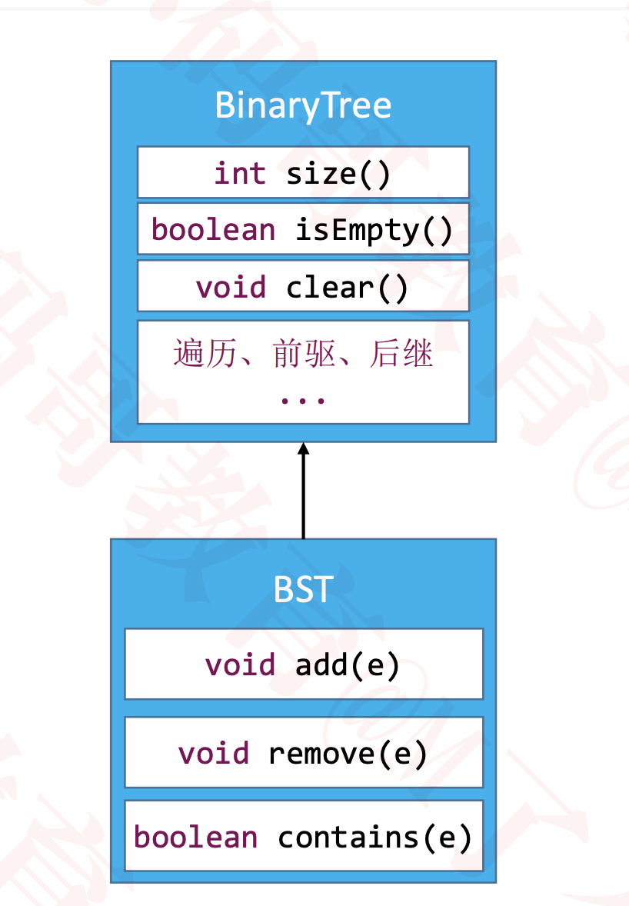

# 思考
在 n 个动态的整数中搜索某个整数？（查看其是否存在）

    假设使用动态数组存放元素，从第 0 个位置开始遍历搜索，平均时间复杂度：O(n)

    如果维护一个有序的动态数组，使用二分搜索，最坏时间复杂度：O(logn)

    但是添加、删除的平均时间复杂度是 O(n)

    使用二叉搜索树，添加、删除、搜索的最坏时间复杂度均可优化至：O(logn)

# 二叉搜索树
    二叉搜索树是二叉树的一种，是应用非常广泛的一种二叉树，英文简称为 BST
        又被称为：二叉查找树、二叉排序树
        任意一个节点的值都大于其左子树所有节点的值
        任意一个节点的值都小于其右子树所有节点的值
        它的左右子树也是一棵二叉搜索树
    二叉搜索树可以大大提高搜索数据的效率
    二叉搜索树存储的元素必须具备可比较性
        比如 int、double 等
        如果是自定义类型，需要指定比较方式
        不允许为 null

# 二叉搜索树的接口设计
    int size() // 元素的数量
    boolean isEmpty() // 是否为空
    void clear() // 清空所有元素
    void add(E element) // 添加元素
    void remove(E element) // 删除元素
    boolean contains(E element) // 是否包含某元素

# 添加节点
    添加步骤
        找到父节点 parent
        创建新节点 node
        parent.left = node 或者 parent.right = node
    遇到值相等的元素建议覆盖旧的值

    元素的比较方案设计
        1. 允许外界传入一个 Comparator 自定义比较方案
        2. 如果没有传入 Comparator，强制认定元素实现了 Comparable 接口

# 删除节点
    1. 叶子节点
        直接删除
        node == node.parent.left
            node.parent.left = null
        node == node.parent.right
            node.parent.right = null
        node.parent == null
            root = null

    2. 度为1的节点
        用子节点替代原节点的位置
        child 是 node.left 或者 child 是 node.right
        
        用 child 替代 node 的位置
        如果 node 是左子节点
            child.parent = node.parent
            node.parent.left = child
        如果 node 是右子节点
            child.parent = node.parent
            node.parent.right = child
        如果 node 是根节点
            root = child
            child.parent = null

    3. 度为2的节点
        先用前驱或者后继节点的值覆盖原节点的值
        然后删除相应的前驱或者后继节点
        如果一个节点的度为 2，那么
            它的前驱、后继节点的度只可能是 1 和 0

# 继承结构

