# AVL树
AVL树是最早发明的自平衡二叉搜索树之一

平衡因子（Balance Factor）：某结点的左右子树的高度差

AVL树的特点
  * 每个节点的平衡因子只可能是 1、0、-1（绝对值 ≤ 1，如果超过 1，称之为“失衡”）
  * 每个节点的左右子树高度差不超过 1
  * 搜索、添加、删除的时间复杂度是 O(logn)

  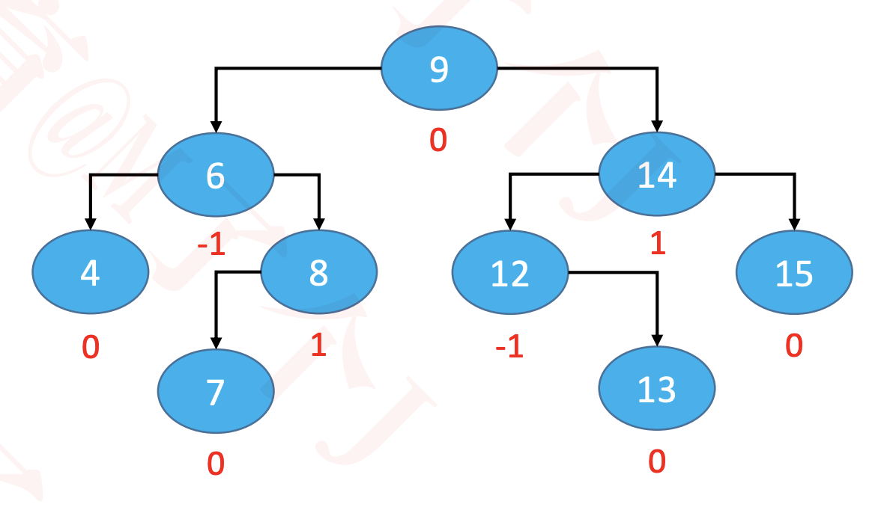

# 添加导致的失衡
  示例：往下面这棵子树中添加 13

  最坏情况：可能会导致所有祖先节点都失衡

  父节点、非祖先节点，都不可能失衡

  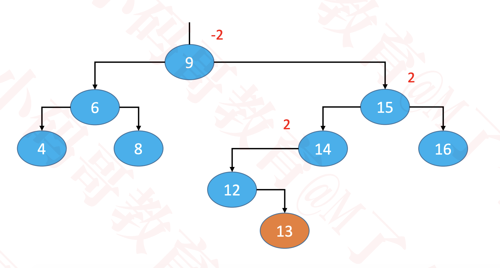

## LL – 右旋转（单旋）
  g.left = p.right

  p.right = g

  让p成为这棵子树的根节点

  仍然是一棵二叉搜索树：T0 < n < T1 < p < T2 < g < T3

  整棵树都达到平衡

  还需要注意维护的内容
  * T2、p、g 的 parent 属性
  * 先后更新 g、p 的高度

  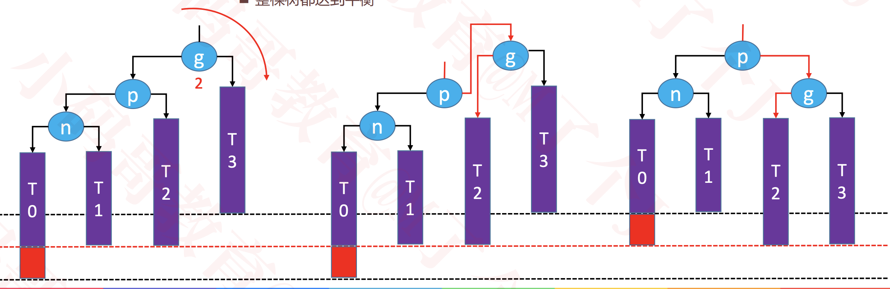

## RR – 左旋转（单旋）
  g.right = p.left

  p.left = g

  让p成为这棵子树的根节点

  仍然是一棵二叉搜索树：T0 < g < T1 < p < T2 < n < T3

  整棵树都达到平衡

  还需要注意维护的内容
  * T1、p、g 的 parent 属性
  * 先后更新 g、p 的高度

  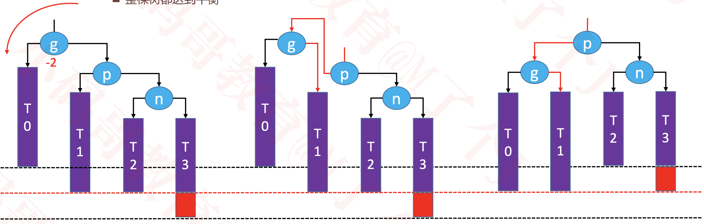

## LR – RR左旋转，LL右旋转（双旋）
  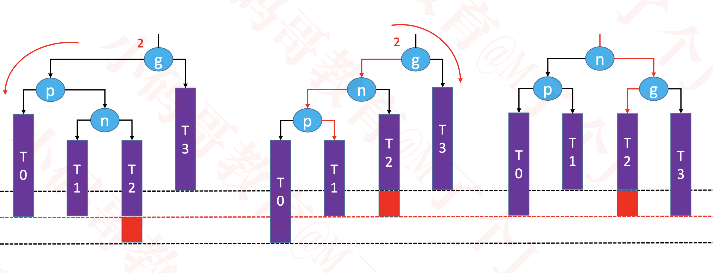

## RL – LL右旋转，RR左旋转（双旋）
  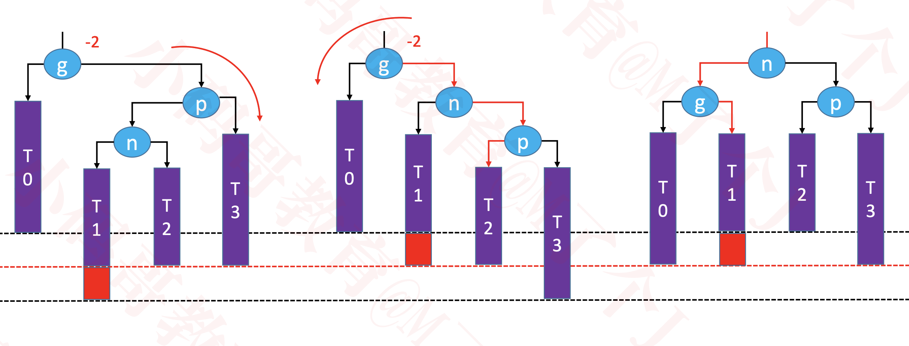

有些教程里面
  * 把右旋转叫做zig，旋转之后的状态叫做zigged
  * 把左旋转叫做zag，旋转之后的状态叫做zagged

## 统一所有旋转操作
  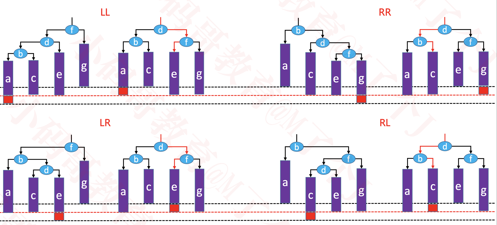

# 删除导致的失衡
   示例：删除子树中的 16

   可能会导致父节点或祖先节点失衡（只有1个节点会失衡），其他节点，都不可能失衡

   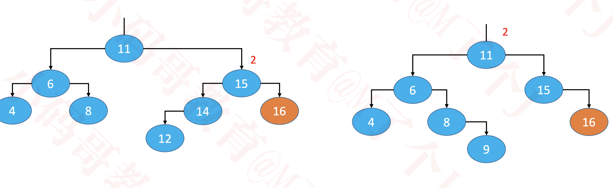

## LL – 右旋转（单旋）
  如果绿色节点不存在，更高层的祖先节点可能也会失衡，需要再次恢复平衡，然后又可能导致更高层的祖先节点失衡...

  极端情况下，所有祖先节点都需要进行恢复平衡的操作，共 O(logn) 次调整

  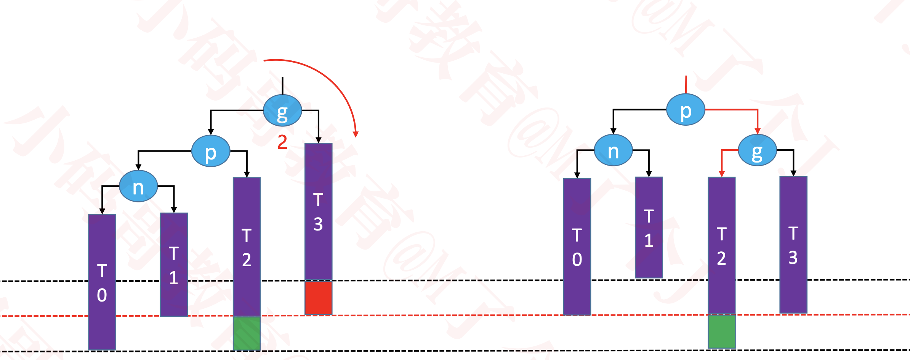

## RR – 左旋转（单旋）
  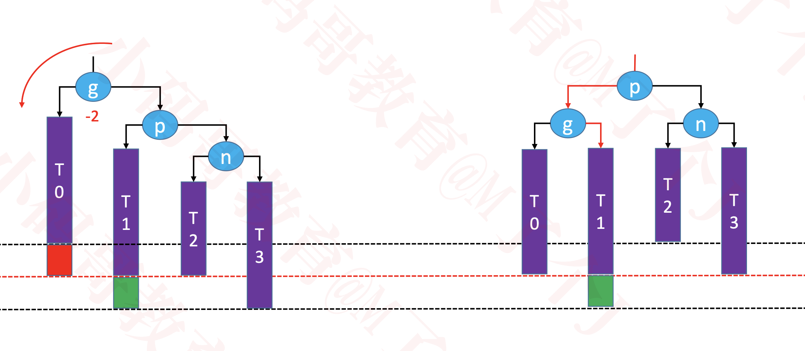

## LR – RR左旋转，LL右旋转（双旋）
  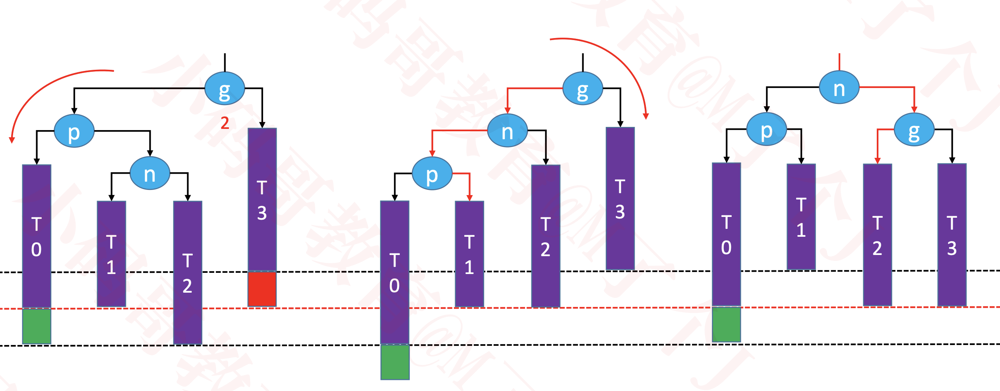

## RL – LL右旋转，RR左旋转（双旋）
  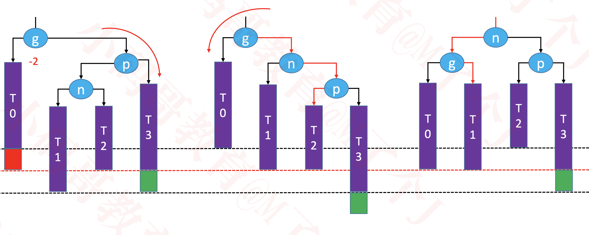

# 总结
  * 添加
    * 可能会导致所有祖先节点都失衡
    * 只要让高度最低的失衡节点恢复平衡，整棵树就恢复平衡【仅需 O(1) 次调整】
  * 删除
    * 可能会导致父节点或祖先节点失衡（只有1个节点会失衡）
    * 恢复平衡后，可能会导致更高层的祖先节点失衡【最多需要 O(logn) 次调整】
  * 平均时间复杂度
    * 搜索：O(logn)
    * 添加：O(logn)，仅需 O(1) 次的旋转操作
    * 删除：O(logn)，最多需要 O(logn) 次的旋转操作