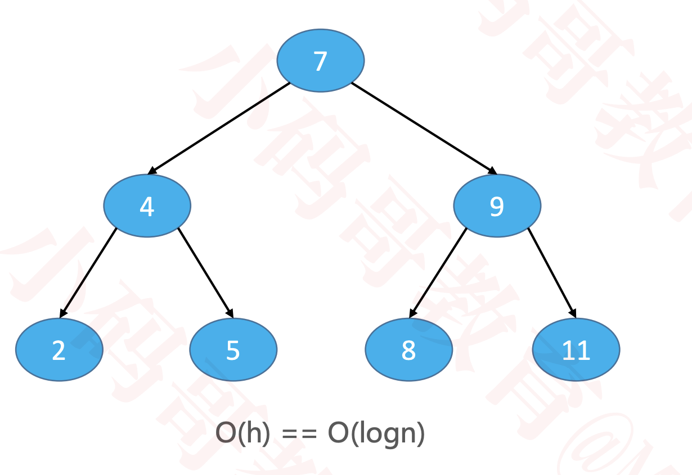
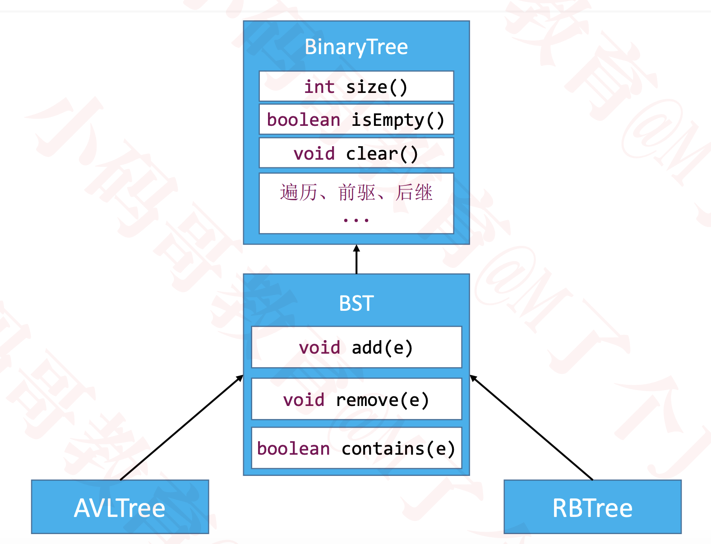

# 二叉搜索树的复杂度分析
  * 如果是按照 7、4、9、2、5、8、11 的顺序添加节点
  
  * 如果是从小到大添加节点
  * 删除节点时也可能会导致二叉搜索树退化成链表
  
  * 当 n 比较大时，两者的性能差异比较大
  * 比如 n = 1000000 时，二叉搜索树的最低高度是 20
  * 平衡二叉搜索树可以让添加、删除、搜索的复杂度维持在 O(logn)

# 平衡（Balance）
  当节点数量固定时，左右子树的高度越接近，这棵二叉树就越平衡（高度越低）
  ## 理想平衡
    最理想的平衡，就是像完全二叉树、满二叉树那样，高度是最小的
  ## 改进二叉搜索树
    首先，节点的添加、删除顺序是无法限制的，可以认为是随机的
    所以，改进方案是：在节点的添加、删除操作之后，想办法让二叉搜索树恢复平衡（减小树的高度）
    如果接着继续调整节点的位置，完全可以达到理想平衡，但是付出的代价可能会比较大
      比如调整的次数会比较多，反而增加了时间复杂度
    总结来说，比较合理的改进方案是：用尽量少的调整次数达到适度平衡即可
    一棵达到适度平衡的二叉搜索树，可以称之为：平衡二叉搜索树

# 平衡二叉搜索树（Balanced Binary Search Tree）
  英文简称为：BBST

  经典常见的平衡二叉搜索树有
  * AVL树

    Windows NT 内核中广泛使用
  
  * 红黑树

    C++ STL（比如 map、set ）

    Java 的 TreeMap、TreeSet、HashMap、HashSet

    Linux 的进程调度

    Ngix 的 timer 管理
  
  一般也称它们为：自平衡的二叉搜索树（Self-balancing Binary Search Tree）

  继承结构
    