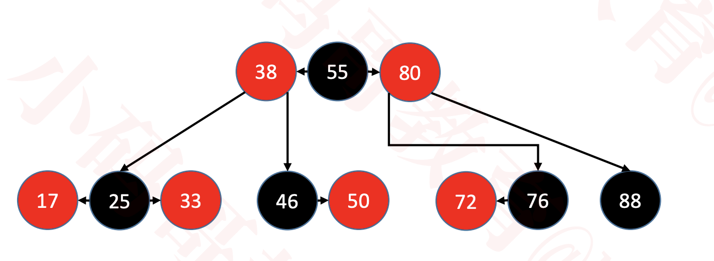

# 红黑树（Red Black Tree）
红黑树也是一种自平衡的二叉搜索树

以前也叫做平衡二叉B树（Symmetric Binary B-tree）

红黑树必须满足以下 5 条性质
  * 节点是 RED 或者 BLACK
  * 根节点是 BLACK
  * 叶子节点（外部节点，空节点）都是 BLACK
  * RED 节点的子节点都是 BLACK
    * RED 节点的 parent 都是 BLACK
    * 从根节点到叶子节点的所有路径上不能有 2 个连续的 RED 节点
  * 从任一节点到叶子节点的所有路径都包含相同数目的 BLACK 节点

# 红黑树的等价变换
红黑树 和 4阶B树（2-3-4树）具有等价性

BLACK 节点与它的 RED 子节点融合在一起，形成1个B树节点

红黑树的 BLACK 节点个数 与 4阶B树的节点总个数 相等

网上有些教程：用 2-3树 与 红黑树 进行类比，这是极其不严谨的，2-3树 并不能完美匹配 红黑树 的所有情况

红黑树 vs 2-3-4树

# 添加
B树中，新元素必定是添加到叶子节点中

4阶B树所有节点的元素个数 x 都符合 1 ≤ x ≤ 3

建议新添加的节点默认为 RED，这样能够让红黑树的性质尽快满足（性质 1、2、3、5 都满足，性质 4 不一定）

如果添加的是根节点，染成 BLACK 即可

## 添加的所有情况
### 有 4 种情况满足红黑树的性质 4 ：parent 为 BLACK
  * 同样也满足 4阶B树 的性质
  * 因此不用做任何额外处理
  

### 有 8 种情况不满足红黑树的性质 4 ：parent 为 RED（ Double Red ）
  * 其中前 4 种属于B树节点上溢的情况
  

#### 添加 – 修复性质4 – LL\RR
    判定条件：uncle 不是 RED
      1. parent 染成 BLACK，grand 染成 RED
      2. grand 进行单旋操作
    LL：右旋转
    RR：左旋转
  

#### 添加 – 修复性质4 – LR\RL
    判定条件：uncle 不是 RED
      1. 自己染成 BLACK，grand 染成 RED
      2. 进行双旋操作
    LR：parent 左旋转， grand 右旋转
    RL：parent 右旋转， grand 左旋转
  

#### 添加 – 修复性质4 – 上溢 – LL
    判定条件：uncle 是 RED
      1. parent、uncle 染成 BLACK
      2. grand 向上合并
    染成 RED，当做是新添加的节点进行处理
    grand 向上合并时，可能继续发生上溢
    若上溢持续到根节点，只需将根节点染成 BLACK
  

#### 添加 – 修复性质4 – 上溢 – RR
    判定条件：uncle 是 RED
      1. parent、uncle 染成 BLACK
      2. grand 向上合并
    染成 RED，当做是新添加的节点进行处理
  

#### 添加 – 修复性质4 – 上溢 – LR
    判定条件：uncle 是 RED
      1. parent、uncle 染成 BLACK
      2. grand 向上合并
    染成 RED，当做是新添加的节点进行处理
    

#### 添加 – 修复性质4 – 上溢 – RL
    判定条件：uncle 是 RED
      1. parent、uncle 染成 BLACK
      2. grand 向上合并
    染成 RED，当做是新添加的节点进行处理
    

# 删除
B树中，最后真正被删除的元素都在叶子节点中
  
## 删除 – RED节点
  直接删除，不用作任何调整
   
## 删除 – BLACK节点
有 3 种情况
* 拥有 2 个 RED 子节点的 BLACK 节点
  * 不可能被直接删除，因为会找它的子节点替代删除
  * 因此不用考虑这种情况
* 拥有 1 个 RED 子节点的 BLACK 节点
* BLACK 叶子节点

 
### 删除 – 拥有1个RED子节点的BLACK节点
    判定条件：用以替代的子节点是 RED
    将替代的子节点染成 BLACK 即可保持红黑树性质
   
### 删除 – BLACK叶子节点 – sibling为BLACK - sibling 至少有 1 个 RED 子节点
    BLACK 叶子节点被删除后，会导致B树节点下溢（比如删除88）
    如果 sibling 至少有 1 个 RED 子节点
      进行旋转操作
      旋转之后的中心节点继承 parent 的颜色
      旋转之后的左右节点染为 BLACK
   
### 删除 – BLACK叶子节点 – sibling为BLACK - sibling 没有 1 个 RED 子节点
    判定条件：sibling 没有 1 个 RED 子节点
    将 sibling 染成 RED、parent 染成 BLACK 即可修复红黑树性质
    如果 parent 是 BLACK
      会导致 parent 也下溢
      这时只需要把 parent 当做被删除的节点处理即可
   
### 删除 – BLACK叶子节点 – sibling为RED
    如果 sibling 是 RED
      sibling 染成 BLACK，parent 染成 RED，进行旋转
      于是又回到 sibling 是 BLACK 的情况
   

# 红黑树的平衡
相比AVL树，红黑树的平衡标准比较宽松：没有一条路径会大于其他路径的2倍

是一种弱平衡、黑高度平衡

红黑树的最大高度是 2 ∗ log2(n + 1) ，依然是 O(logn) 级别

 

# 平均时间复杂度
搜索：O(logn)

添加：O(logn)，O(1) 次的旋转操作

删除：O(logn)，O(1) 次的旋转操作

# AVL树 vs 红黑树
  * AVL树
    * 平衡标准比较严格：每个左右子树的高度差不超过1
    * 最大高度是 1.44 ∗ log2 n + 2 − 1.328（100W个节点，AVL树最大树高28）
    * 搜索、添加、删除都是 O(logn) 复杂度，其中添加仅需 O(1) 次旋转调整、删除最多需要 O(logn) 次旋转调整
  
  * 红黑树
    * 平衡标准比较宽松：没有一条路径会大于其他路径的2倍
    * 最大高度是 2 ∗ log2(n + 1)（ 100W个节点，红黑树最大树高40）
    * 搜索、添加、删除都是 O(logn) 复杂度，其中添加、删除都仅需 O(1) 次旋转调整
  
  搜索的次数远远大于插入和删除，选择AVL树；搜索、插入、删除次数几乎差不多，选择红黑树

  相对于AVL树来说，红黑树牺牲了部分平衡性以换取插入/删除操作时少量的旋转操作，整体来说性能要优于AVL树

  红黑树的平均统计性能优于AVL树，实际应用中更多选择使用红黑树

