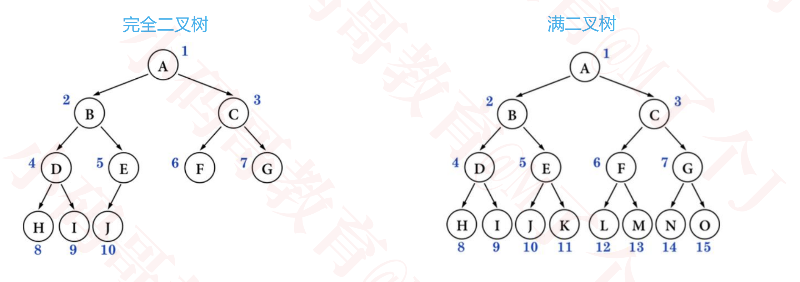
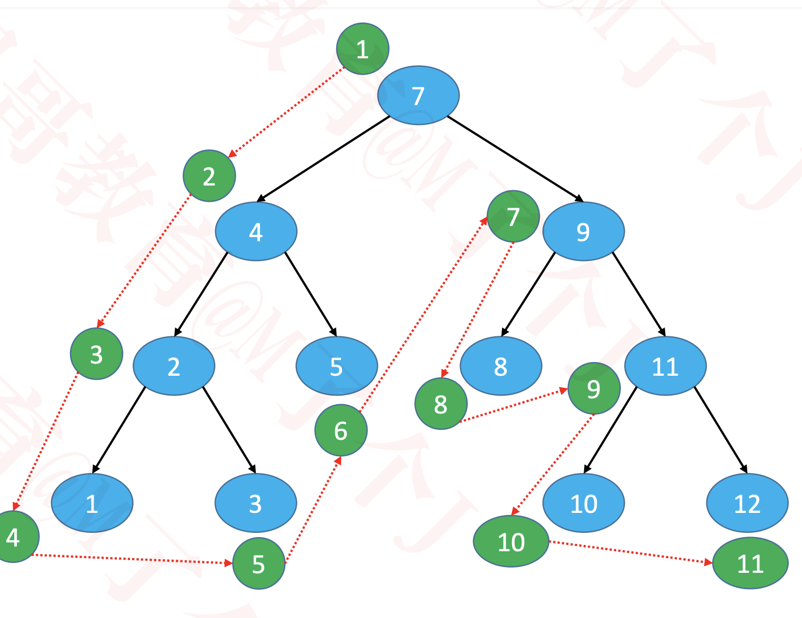
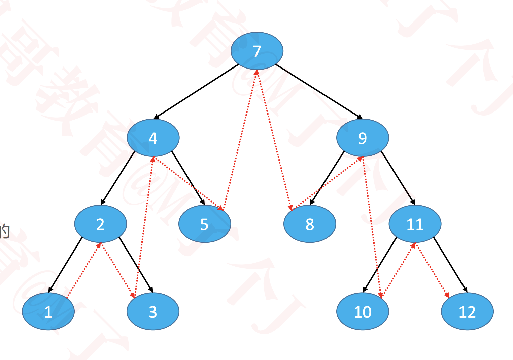
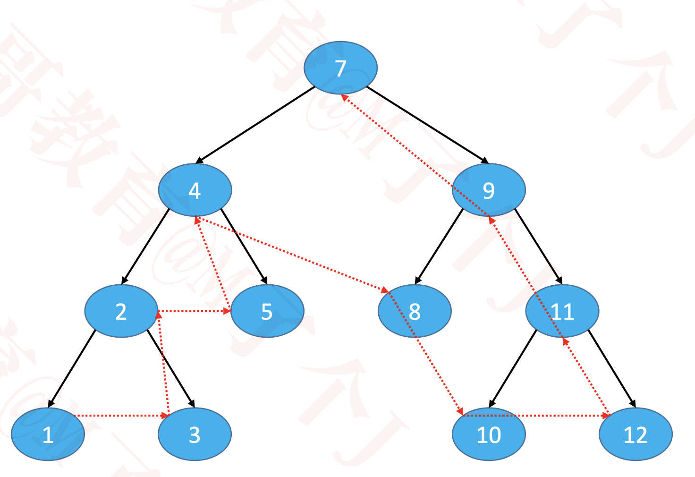
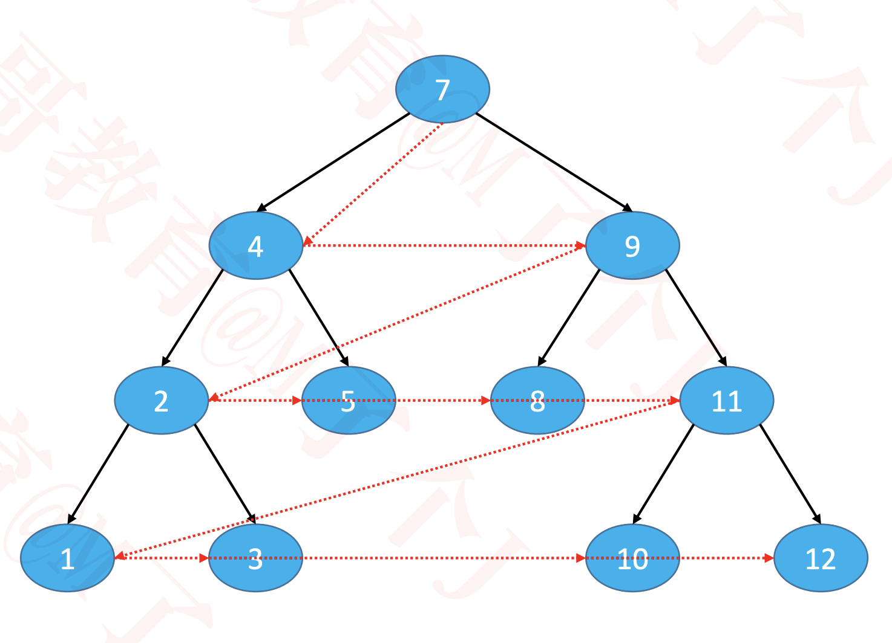
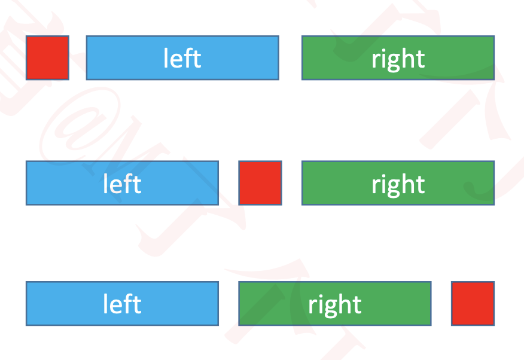
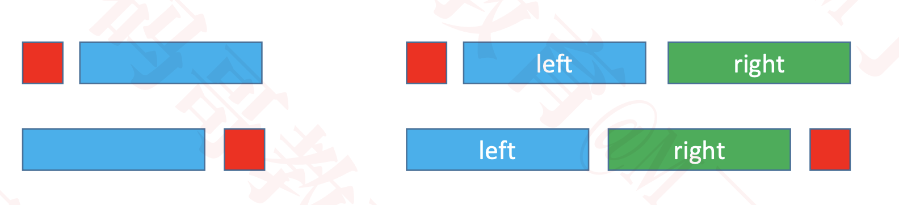

# 二叉树的特点
  * 每个节点的度最大为 2（最多拥有 2 棵子树）
  * 左子树和右子树是有顺序的
  * 即使某节点只有一棵子树，也要区分左右子树
  * 二叉树是有序树

# 二叉树的性质
  * 非空二叉树的第 i 层，最多有 2^i − 1 个节点（ i ≥ 1 ）
  * 在高度为 h 的二叉树上最多有 2^h − 1 个结点（ h ≥ 1 ）
  * 对于任何一棵非空二叉树，如果叶子节点个数为 n0，度为 2 的节点个数为 n2，则有: n0 = n2 + 1
    * 假设度为 1 的节点个数为 n1，那么二叉树的节点总数 n = n0 + n1 + n2
    * 二叉树的边数 T = n1 + 2 * n2 = n – 1 = n0 + n1 + n2 – 1
    * 因此 n0 = n2 + 1

# 真二叉树（Proper Binary Tree）
  * Full Binary Tree 国外教材的说法
  * 所有节点的度都要么为 0，要么为 2

# 满二叉树（Full Binary Tree）
  * Perfect Binary Tree 国外教材的说法
  * 最后一层节点的度都为 0，其他节点的度都为 2
  * 假设满二叉树的高度为 h（ h ≥ 1 ），那么
    * 第 i 层的节点数量： 2^i − 1
    * 叶子节点数量： 2^h − 1
    * 总节点数量 n
      * n = 2^h − 1 = 2^0 + 2^1 + 2^2 + ⋯ + 2^h−1
      * h = log2(n + 1)
  * 在同样高度的二叉树中，满二叉树的叶子节点数量最多、总节点数量最多
  * 满二叉树一定是真二叉树，真二叉树不一定是满二叉树

# 完全二叉树（Complete Binary Tree）
  * 对节点从上至下、左至右开始编号，其所有编号都能与相同高度的满二叉树中的编号对应 
  * 叶子节点只会出现最后 2 层，最后 1 层的叶子结点都靠左对齐
  * 完全二叉树从根结点至倒数第 2 层是一棵满二叉树
  * 满二叉树一定是完全二叉树，完全二叉树不一定是满二叉树
  

  ## 完全二叉树的性质
    度为 1 的节点只有左子树
    度为 1 的节点要么是 1 个，要么是 0 个
    同样节点数量的二叉树，完全二叉树的高度最小
    假设完全二叉树的高度为 h（ h ≥ 1 ），那么
      至少有 2^h − 1 个节点 （ 2^0 + 2^1 + 2^2 + ⋯ + 2^h−2 + 1 ）
      最多有 2^h − 1 个节点（ 2^0 + 2^1 + 2^2 + ⋯ + 2^h−1，满二叉树 ）
      总节点数量为 n
        2^h − 1 ≤ n < 2^h
        h − 1 ≤ log2n < h
        h = floor( log2n ) + 1
    一棵有 n 个节点的完全二叉树（n > 0），从上到下、从左到右对节点从 1 开始进行编号，对任意第 i 个节点
      如果 i = 1 ，它是根节点
      如果 i > 1 ，它的父节点编号为 floor( i / 2 )
      如果 2i ≤ n ，它的左子节点编号为 2i
      如果 2i > n ，它无左子节点
      如果 2i + 1 ≤ n ，它的右子节点编号为 2i + 1
      如果 2i + 1 > n ，它无右子节点
    
    一棵有 n 个节点的完全二叉树（n > 0），从上到下、从左到右对节点从 0 开始进行编号，对任意第 i 个节点
      如果 i = 0 ，它是根节点
      如果 i > 0 ，它的父节点编号为 floor( (i – 1) / 2 )
      如果 2i + 1 ≤ n – 1 ，它的左子节点编号为 2i + 1
      如果 2i + 1 > n – 1 ，它无左子节点
      如果 2i + 2 ≤ n – 1 ，它的右子节点编号为 2i + 2
      如果 2i + 2 > n – 1 ，它无右子节点
  
  ## 面试题
    如果一棵完全二叉树有 768 个节点，求叶子节点的个数
      假设叶子节点个数为 n0，度为 1 的节点个数为 n1，度为 2 的节点个数为 n2
      总结点个数 n = n0 + n1 + n2，而且 n0 = n2 + 1
      n = 2n0 + n1 – 1

      完全二叉树的 n1 要么为 0，要么为 1
        n1为1时，n = 2n0，n 必然是偶数
        叶子节点个数 n0 = n / 2，非叶子节点个数 n1 + n2 = n / 2
      
        n1为0时，n = 2n0 – 1，n 必然是奇数
        叶子节点个数 n0 = (n + 1) / 2，非叶子节点个数 n1 + n2 = (n – 1) / 2
      
      叶子节点个数 n0 = floor( (n + 1) / 2 ) = ceiling( n / 2 )
      非叶子节点个数 n1 + n2 = floor( n / 2 ) = ceiling( (n – 1) / 2 ) 
      因此叶子节点个数为 384

# 二叉树的遍历
  * 二叉树的常见遍历方式有4种
    * 前序遍历（Preorder Traversal）
    * 中序遍历（Inorder Traversal）
    * 后序遍历（Postorder Traversal）
    * 层序遍历（Level Order Traversal）
  
  * 前序遍历（Preorder Traversal）

    根节点、前序遍历左子树、前序遍历右子树
    
  
    #### 前序遍历 – 非递归
      * 利用栈实现第一种
        * 设置 node = root
        * 循环执行以下操作
          * 如果 node != null
            * 对 node 进行访问
            * 将 node.right 入栈
            * 设置 node = node.left
          * 如果 node == null
            * 如果栈为空，结束遍历
            * 如果栈不为空，弹出栈顶元素并赋值给 node
      * 利用栈实现第二种
        * 将 root 入栈
        * 循环执行以下操作，直到栈为空
          * 弹出栈顶节点 top，进行访问
          * 将 top.right 入栈
          * 将 top.left 入栈
    
  * 中序遍历（Inorder Traversal）

    中序遍历左子树、根节点、中序遍历右子树

    或者

    中序遍历右子树、根节点、中序遍历左子树

    二叉搜索树的中序遍历结果是升序或者降序的
    

    #### 中序遍历 – 非递归
      * 利用栈实现
        * 设置 node = root
        * 循环执行以下操作
          * 如果 node != null
            * 将 node 入栈
            * 设置 node = node.left
          * 如果 node == null
            * 如果栈为空，结束遍历
            * 如果栈不为空，弹出栈顶元素并赋值给 node
              * 对 node 进行访问
              * 设置 node = node.right

  * 后序遍历（Postorder Traversal）

    后序遍历左子树、后序遍历右子树、根节点
    

    #### 后序遍历 – 非递归
      * 利用栈实现
        * 将 root 入栈
        * 循环执行以下操作，直到栈为空
          * 如果栈顶节点是叶子节点 或者 上一次访问的节点是栈顶节点的子节点
            * 弹出栈顶节点，进行访问
          * 否则
            * 将栈顶节点的right、left按顺序入栈
  
  * 层序遍历（Level Order Traversal）

    从上到下、从左到右依次访问每一个节点
    

    #### 层序遍历 - 非递归
      * 使用队列
        * 将根节点入队
        * 循环执行以下操作，直到队列为空
          * 将队头节点 A 出队，进行访问
          * 将 A 的左子节点入队
          * 将 A 的右子节点入队

  ## 遍历的应用
    前序遍历
        树状结构展示（注意左右子树的顺序）
    中序遍历
        二叉搜索树的中序遍历按升序或者降序处理节点
    后序遍历
        适用于一些先子后父的操作
    层序遍历
        计算二叉树的高度
        判断一棵树是否为完全二叉树

# 根据遍历结果重构二叉树
  * 以下结果可以保证重构出唯一的一棵二叉树
    * 前序遍历 + 中序遍历
    * 后序遍历 + 中序遍历
    

  * 前序遍历 + 后序遍历
    * 如果它是一棵真二叉树（Proper Binary Tree），结果是唯一的
    * 不然结果不唯一
    

# 判断一棵树是否为完全二叉树
  * 如果树为空，返回 false
  * 如果树不为空，开始层序遍历二叉树（用队列）
    * 如果 node.left!=null，将 node.left 入队
    * 如果 node.left==null && node.right!=null，返回 false
    * 如果 node.right!=null，将 node.right 入队
    * 如果 node.right==null
      * 那么后面遍历的节点应该都为叶子节点，才是完全二叉树
      * 否则返回 false
    * 遍历结束，返回 true

# 前驱节点（predecessor）
  * 前驱节点：中序遍历时的前一个节点
  * 如果是二叉搜索树，前驱节点就是前一个比它小的节点
  * node.left != null
    * predecessor = node.left.right.right.right...
    * 终止条件：right 为 null
  * node.left == null && node.parent != null
    * predecessor = node.parent.parent.parent...
    * 终止条件：node 在 parent 的右子树中
  * node.left == null && node.parent == null
    * 那就没有前驱节点
    * 举例：没有左子树的根节点

# 后继节点（successor）
  * 后继节点：中序遍历时的后一个节点
  * 如果是二叉搜索树，后继节点就是后一个比它大的节点
  * node.right != null
    * successor = node.right.left.left.left...
    * 终止条件：left 为 null
  * node.right == null && node.parent != null
    * successor = node.parent.parent.parent...
    * 终止条件：node 在 parent 的左子树中
  * node.right == null && node.parent == null
    * 那就没有前驱节点
    * 举例：没有右子树的根节点

