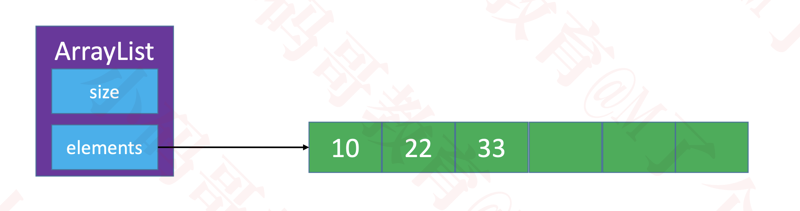

# 数组是一种顺序存储的线性表，所有元素的内存地址是连续的
  

# 动态数组（Dynamic Array）接口设计
  * int size(); // 元素的数量
  * boolean isEmpty(); // 是否为空
  * boolean contains(E element); // 是否包含某个元素
  * void add(E element); // 添加元素到最后面
  * E get(int index); // 返回index位置对应的元素
  * E set(int index, E element); // 设置index位置的元素
  * void add(int index, E element); // 往index位置添加元素
  * E remove(int index); // 删除index位置对应的元素
  * int indexOf(E element); // 查看元素的位置
  * void clear(); // 清除所有元素

# 动态数组的设计
  

# 扩容
  

# 对象数组
  

# 动态数组add(E element)复杂度分析
  
  经过连续的多次复杂度比较低的情况后，出现个别复杂度比较高的情况适合使用均摊复杂度

# 动态数组的缩容
  * 如果内存使用比较紧张，动态数组有比较多的剩余空间，可以考虑进行缩容操作
    * 比如剩余空间占总容量的一半时，就进行缩容
  * 如果扩容倍数、缩容时机设计不得当，有可能会导致复杂度震荡