# 链表（Linked List）
  * 动态数组有个明显的缺点
    可能会造成内存空间的大量浪费
  * 能否用到多少就申请多少内存？
    链表可以办到这一点
  * 链表是一种链式存储的线性表，所有元素的内存地址不一定是连续的

  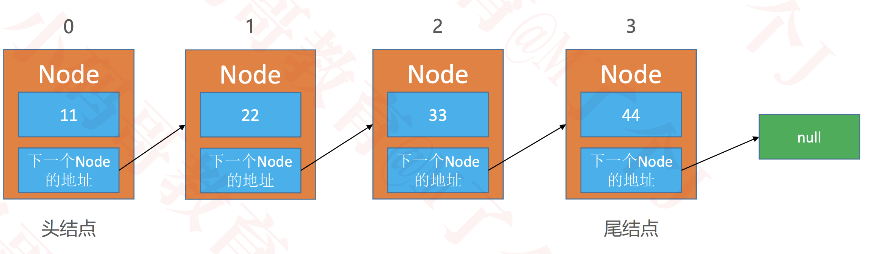

# 链表的设计
  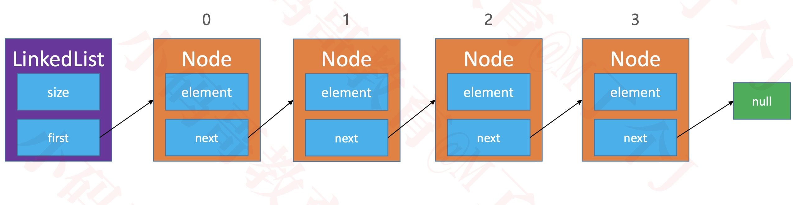

# 反转一个链表 
  1. 递归
    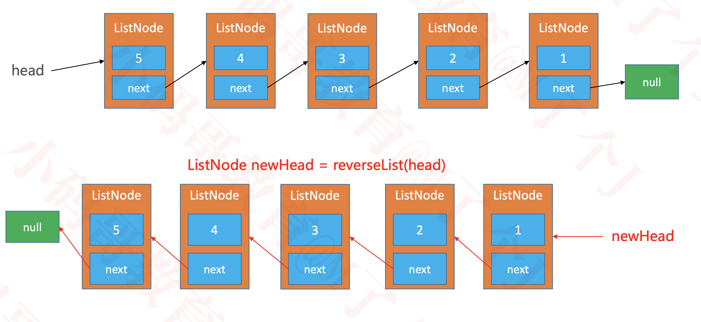
    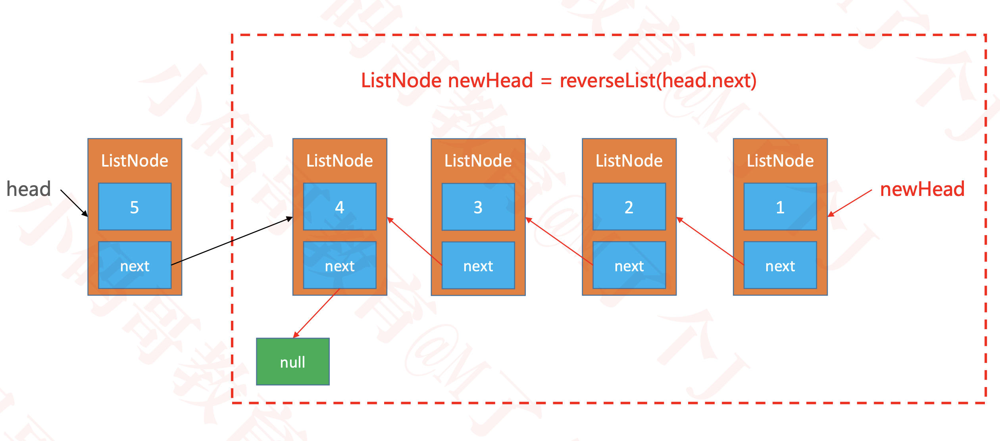
  2. 头插法
    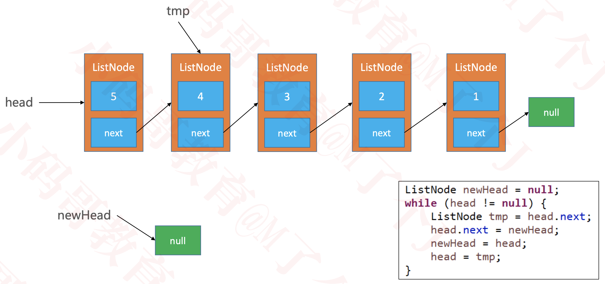

# 判断一个链表是否有环
  * 使用快慢指针
  
    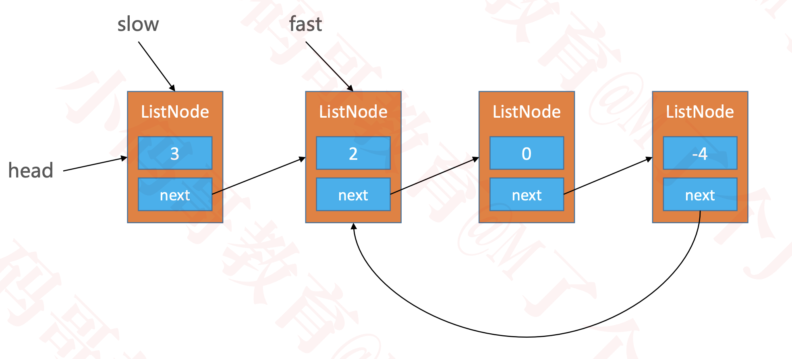

# 虚拟头结点
  * 有时候为了让代码更加精简，统一所有节点的处理逻辑，可以在最前面增加一个虚拟的头结点（不存储数据） 不过不推荐使用
  
    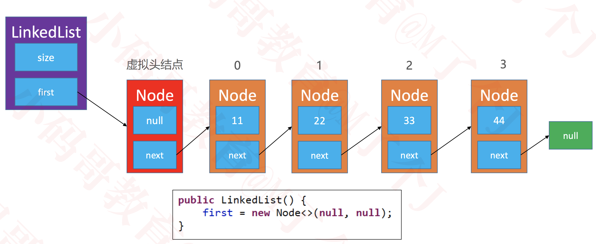

# 双向链表
  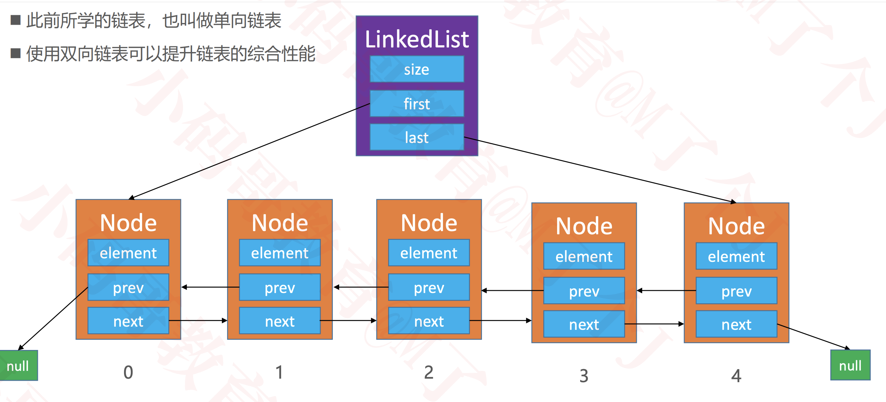

  * 只有一个元素
    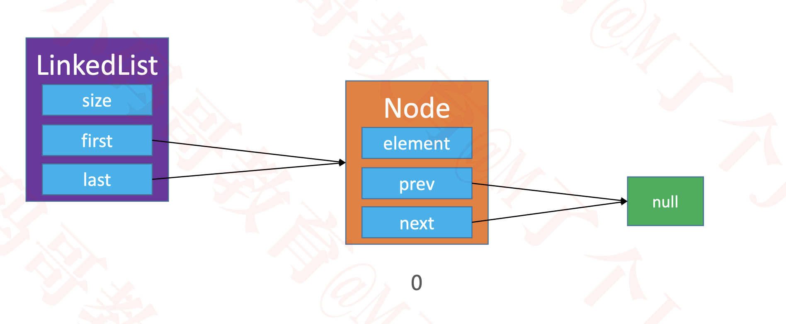
  
  * 双向链表 vs 单向链表  
    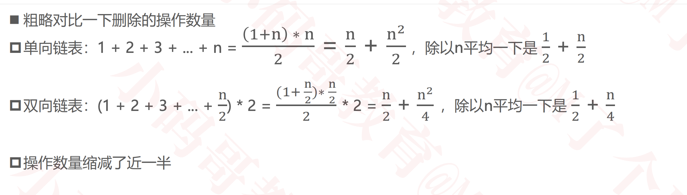

# 双向链表 vs 动态数组
  动态数组：开辟、销毁内存空间的次数相对较少，但可能造成内存空间浪费（可以通过缩容解决）

  双向链表：开辟、销毁内存空间的次数相对较多，但不会造成内存空间的浪费

  * * *

  如果频繁在尾部进行添加、删除操作，动态数组、双向链表均可选择

  如果频繁在头部进行添加、删除操作，建议选择使用双向链表

  如果有频繁的（在任意位置）添加、删除操作，建议选择使用双向链表

  如果有频繁的查询操作（随机访问操作），建议选择使用动态数组

  * * * 

  有了双向链表，单向链表是否就没有任何用处了？

  并非如此，在哈希表的设计中就用到了单链表

# 单向循环链表
  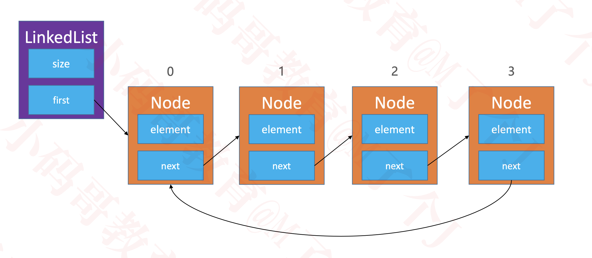

  * 只有1个节点
    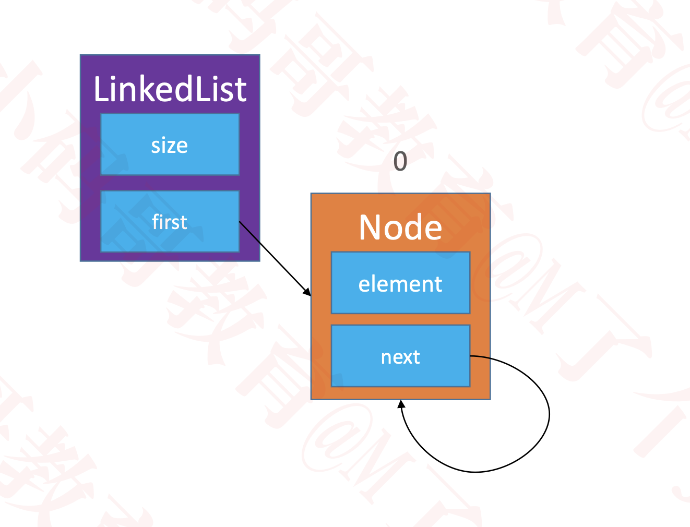

# 双向循环链表
  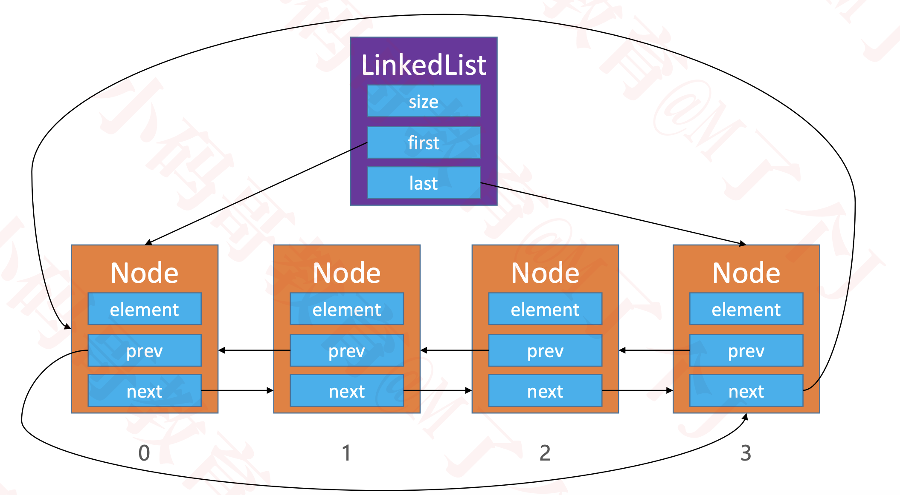

  * 只有1个节点
    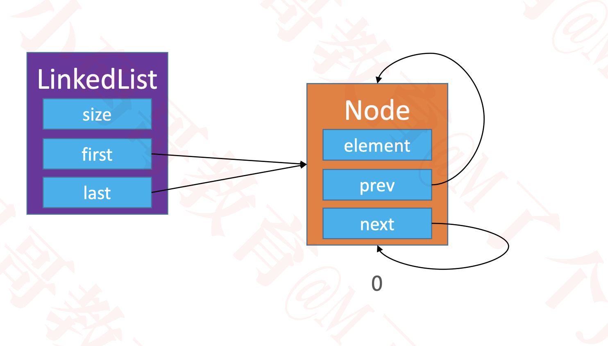

# 如何发挥循环链表的最大威力
  * 可以考虑增设1个成员变量、3个方法
    * current ：用于指向某个节点
    * void reset() ：让 current 指向头结点 first
    * E next() ：让 current 往后走一步，也就是 current = current.next
    * E remove() ：删除 current 指向的节点，删除成功后让 current 指向下一个节点

# 静态链表
  * 前面所学习的链表，是依赖于指针（引用）实现的
  * 有些编程语言是没有指针的，比如早期的 BASIC、FORTRAN 语言
  * 没有指针的情况下，如何实现链表？
    * 可以通过数组来模拟链表，称为静态链表
    * 数组的每个元素存放 2 个数据：值、下个元素的索引
    * 数组 0 位置存放的是头结点信息
  * 如果数组的每个元素只能存放 1 个数据呢？
    * 那就使用 2 个数组，1 个数组存放索引关系，1 个数组存放值
